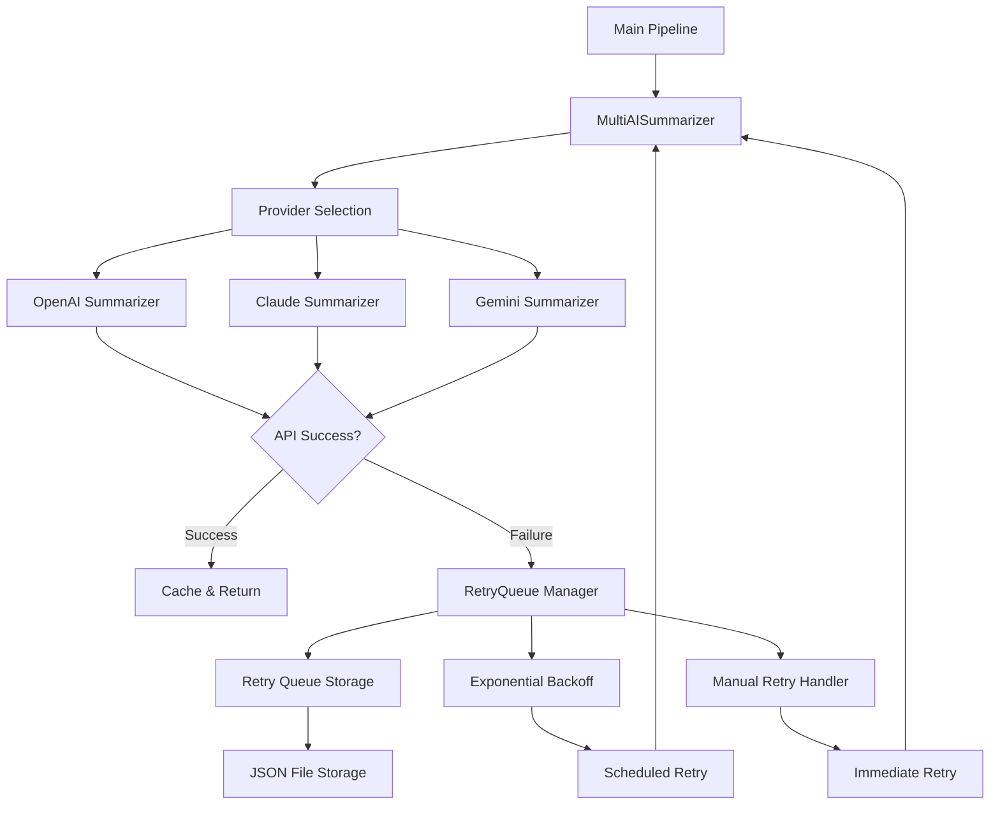
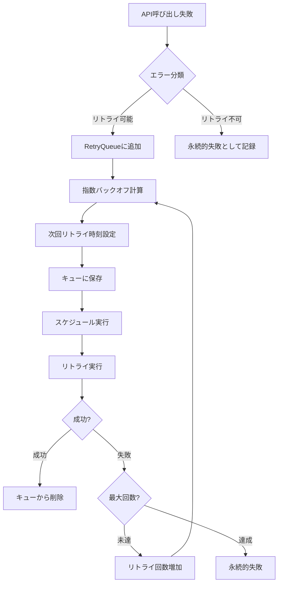

# 設計書

## 概要

AI記事要約処理において、API制限やその他の一時的なエラーで失敗した記事を自動的にリトライするシステムを設計します。現在のマルチプロバイダーシステムに統合し、失敗した記事の永続化、指数バックオフリトライ、手動リトライ機能を提供します。

## アーキテクチャ

### システム構成図



### コンポーネント設計

#### 1. RetryQueueManager
- **責任**: リトライキューの管理、失敗記事の保存・取得
- **場所**: `shared/retry/retry_queue_manager.py`
- **主要メソッド**:
  - `add_failed_article()`: 失敗記事をキューに追加
  - `get_retry_candidates()`: リトライ対象記事を取得
  - `mark_success()`: 成功記事をキューから削除
  - `mark_failure()`: 失敗記事のリトライ回数を増加

#### 2. RetryScheduler
- **責任**: 指数バックオフスケジューリング、自動リトライ実行
- **場所**: `shared/retry/retry_scheduler.py`
- **主要メソッド**:
  - `schedule_retry()`: リトライスケジュールを計算
  - `execute_scheduled_retries()`: スケジュールされたリトライを実行
  - `calculate_backoff_delay()`: 指数バックオフ遅延を計算

#### 3. RetryStorage
- **責任**: リトライキューデータの永続化
- **場所**: `shared/retry/retry_storage.py`
- **主要メソッド**:
  - `save_queue()`: キューをJSONファイルに保存
  - `load_queue()`: JSONファイルからキューを読み込み
  - `cleanup_old_entries()`: 古いエントリのクリーンアップ

#### 4. ManualRetryHandler
- **責任**: 手動リトライ機能の提供
- **場所**: `shared/retry/manual_retry_handler.py`
- **主要メソッド**:
  - `retry_all()`: すべての失敗記事をリトライ
  - `retry_by_provider()`: 特定プロバイダーの失敗記事をリトライ
  - `get_retry_status()`: リトライキューの状態を取得

## データモデル

### RetryQueueItem
```python
@dataclass
class RetryQueueItem:
    """リトライキューアイテム"""
    id: str                          # 記事ID
    article_data: Dict[str, Any]     # 元記事データ（RawNewsItem）
    failure_reason: str              # 失敗理由
    failure_timestamp: datetime      # 失敗時刻
    retry_count: int                 # リトライ回数
    next_retry_time: datetime        # 次回リトライ時刻
    provider_failures: Dict[str, int] # プロバイダー別失敗回数
    max_retries: int = 5             # 最大リトライ回数
    created_at: datetime             # 作成日時
    
    def is_expired(self) -> bool:
        """リトライ期限切れかチェック"""
        return self.retry_count >= self.max_retries
    
    def can_retry_now(self) -> bool:
        """現在リトライ可能かチェック"""
        return datetime.now() >= self.next_retry_time
```

### RetryQueue
```python
@dataclass
class RetryQueue:
    """リトライキュー"""
    items: List[RetryQueueItem]      # キューアイテム
    last_updated: datetime           # 最終更新時刻
    total_processed: int = 0         # 総処理数
    total_succeeded: int = 0         # 総成功数
    total_failed: int = 0            # 総失敗数
    
    def get_active_items(self) -> List[RetryQueueItem]:
        """アクティブなアイテムを取得"""
        return [item for item in self.items if not item.is_expired()]
    
    def get_retry_candidates(self) -> List[RetryQueueItem]:
        """リトライ対象アイテムを取得"""
        return [item for item in self.get_active_items() if item.can_retry_now()]
```

## コンポーネントとインターフェース

### 1. MultiAISummarizerとの統合

既存の`MultiAISummarizer`クラスを拡張し、リトライ機能を統合します。

```python
class MultiAISummarizer:
    def __init__(self, config: AppConfig):
        # 既存の初期化
        self.retry_manager = RetryQueueManager(config)
        self.retry_scheduler = RetryScheduler(config)
    
    async def summarize_article(self, article: RawNewsItem) -> Optional[NewsItem]:
        """リトライ機能付き記事要約"""
        # 既存の処理 + エラー時のリトライキュー追加
        
    async def batch_process(self, articles: List[RawNewsItem]) -> List[NewsItem]:
        """バッチ処理 + 失敗記事のリトライキュー追加"""
        
    async def process_retry_queue(self) -> List[NewsItem]:
        """リトライキューの処理"""
```

### 2. エラーハンドリングの強化

現在のプロバイダー別エラーハンドリングを拡張し、リトライ対象エラーを識別します。

```python
class ErrorClassifier:
    """エラー分類器"""
    
    @staticmethod
    def is_retryable_error(error: Exception) -> bool:
        """リトライ可能なエラーかチェック"""
        error_str = str(error).lower()
        retryable_patterns = [
            "rate_limit", "429", "quota", "throttle",
            "timeout", "connection", "network",
            "service_unavailable", "503", "502"
        ]
        return any(pattern in error_str for pattern in retryable_patterns)
    
    @staticmethod
    def get_failure_reason(error: Exception) -> str:
        """失敗理由を取得"""
        # エラーメッセージから構造化された失敗理由を抽出
```

### 3. 設定管理

リトライ関連の設定を`AppConfig`に追加します。

```python
@dataclass
class RetryConfig:
    """リトライ設定"""
    max_retries: int = 5
    initial_delay: int = 300  # 5分
    max_delay: int = 86400    # 24時間
    backoff_multiplier: float = 2.0
    queue_file_path: str = "data/retry_queue.json"
    cleanup_days: int = 7
    enable_manual_retry: bool = True
```

## エラーハンドリング

### エラー分類

1. **リトライ可能エラー**
   - API制限エラー (429, quota exceeded)
   - 一時的なネットワークエラー
   - サービス一時停止 (503, 502)
   - タイムアウトエラー

2. **リトライ不可エラー**
   - 認証エラー (401, 403)
   - 不正なリクエスト (400)
   - 記事内容の問題
   - 設定エラー

### エラー処理フロー



## テスト戦略

### 1. 単体テスト

各コンポーネントの単体テストを作成します。

```python
# tests/test_retry_queue_manager.py
class TestRetryQueueManager:
    def test_add_failed_article(self):
        """失敗記事の追加テスト"""
        
    def test_get_retry_candidates(self):
        """リトライ候補取得テスト"""
        
    def test_exponential_backoff(self):
        """指数バックオフ計算テスト"""
```

### 2. 統合テスト

実際のAPI制限エラーをシミュレートした統合テストを作成します。

```python
# tests/test_retry_integration.py
class TestRetryIntegration:
    async def test_api_limit_retry(self):
        """API制限エラーのリトライテスト"""
        
    async def test_provider_fallback_with_retry(self):
        """プロバイダーフォールバック + リトライテスト"""
```

### 3. エンドツーエンドテスト

実際のワークフローでのリトライ機能をテストします。

```python
# tests/test_retry_e2e.py
class TestRetryEndToEnd:
    async def test_full_retry_workflow(self):
        """完全なリトライワークフローテスト"""
```

## パフォーマンス考慮事項

### 1. メモリ使用量
- リトライキューのサイズ制限（最大1000件）
- 古いエントリの自動クリーンアップ
- 大きな記事データの圧縮保存

### 2. ディスクI/O最適化
- バッチでのキュー更新
- 差分更新による書き込み最小化
- 非同期ファイル操作

### 3. 並行処理
- リトライ処理の並行実行
- メインパイプラインとの非同期実行
- デッドロック防止

## セキュリティ考慮事項

### 1. データ保護
- APIキーの記事データからの除外
- 機密情報のマスキング
- ファイル権限の適切な設定

### 2. エラー情報の管理
- 詳細なエラー情報のログ制限
- 個人情報の除外
- セキュリティ関連エラーの特別処理

## 監視とログ

### 1. メトリクス
- リトライキューサイズ
- 成功/失敗率
- 平均リトライ回数
- プロバイダー別エラー率

### 2. アラート
- キューサイズ異常増加
- 連続失敗の検出
- プロバイダー全停止

### 3. ダッシュボード
- リアルタイムキュー状況
- エラー傾向分析
- プロバイダー健全性

## 実装フェーズ

### フェーズ1: 基本リトライ機能
- RetryQueueManager実装
- 基本的なエラー分類
- JSON永続化

### フェーズ2: 指数バックオフ
- RetryScheduler実装
- 自動リトライ実行
- 設定管理

### フェーズ3: 手動リトライ
- ManualRetryHandler実装
- CLI コマンド
- 状態監視

### フェーズ4: 統合とテスト
- MultiAISummarizerとの統合
- 包括的テスト
- パフォーマンス最適化

### フェーズ5: 監視とアラート
- メトリクス収集
- ダッシュボード
- アラート機能