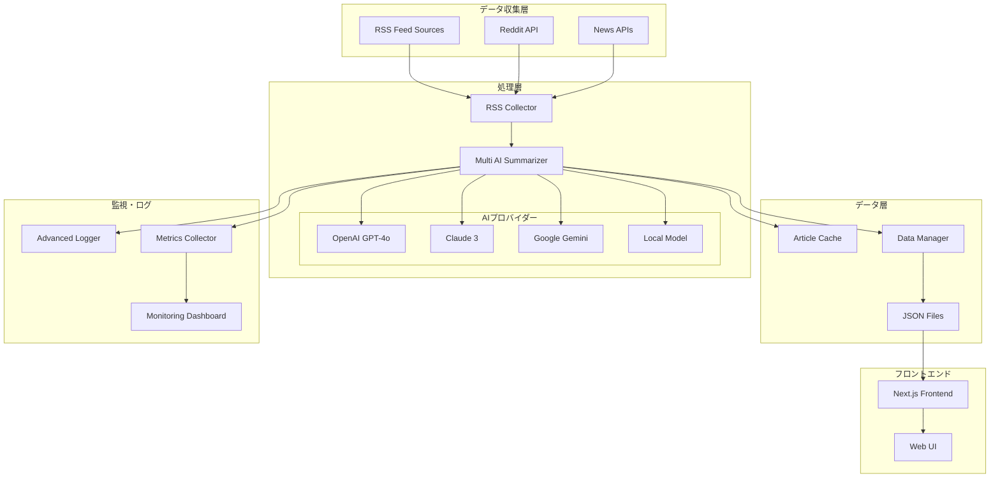
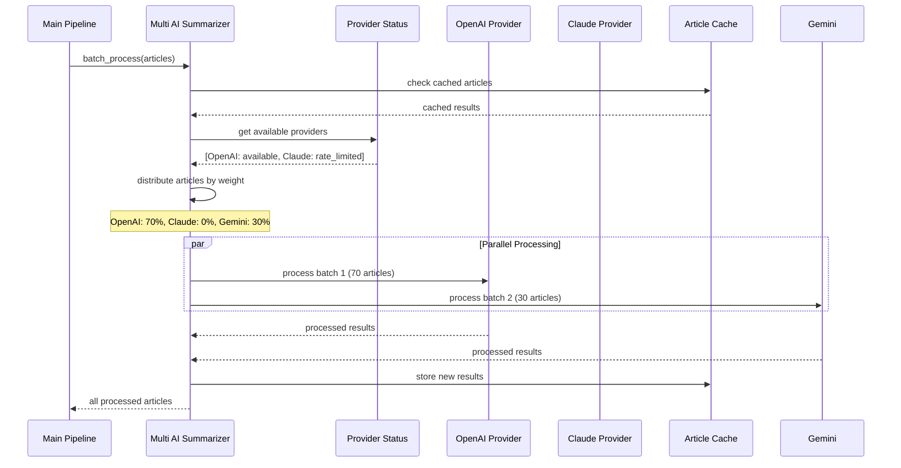
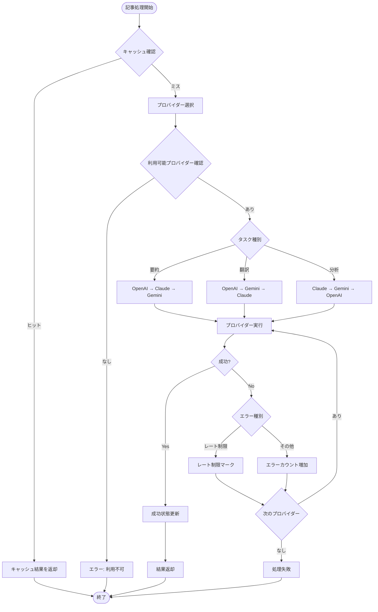
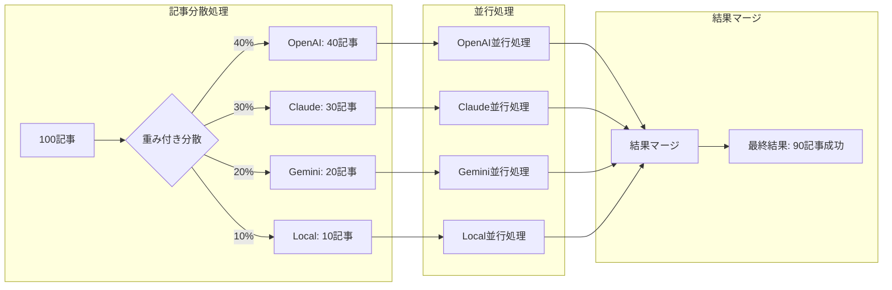
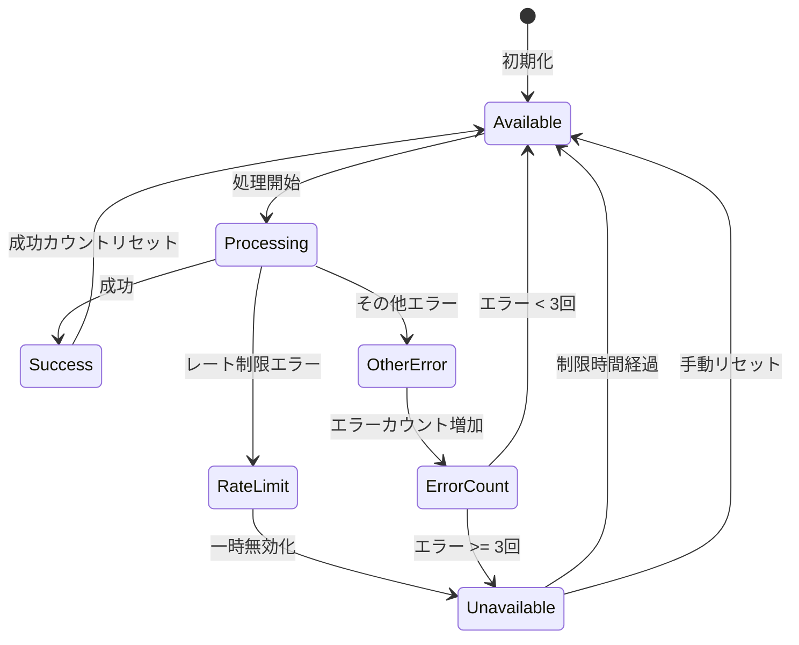
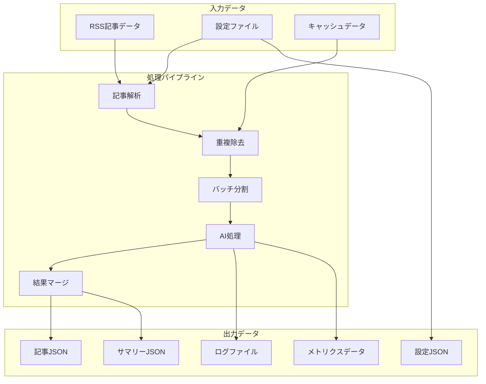
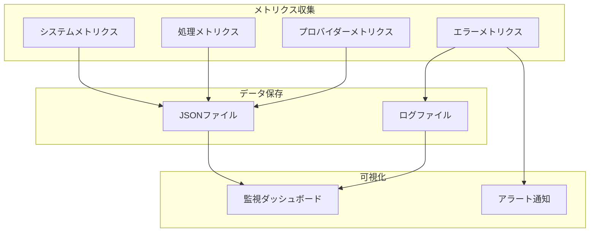
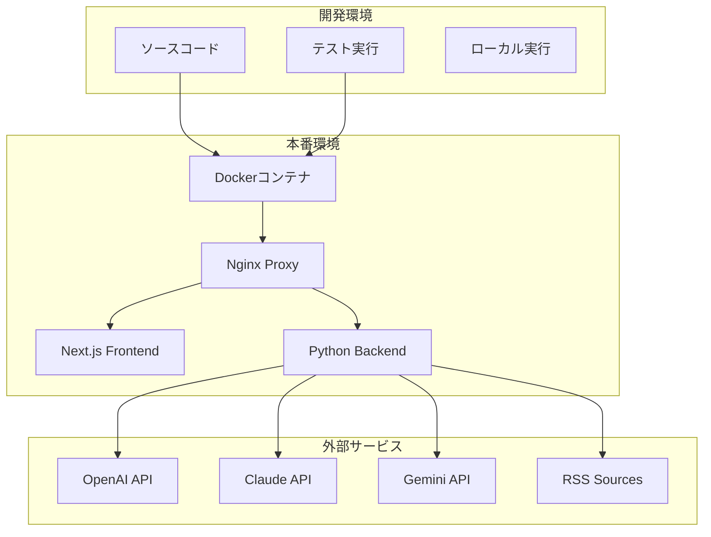
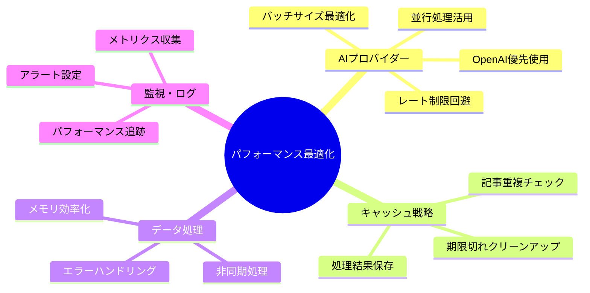

# AI News Aggregator アーキテクチャ図

## システム全体構成

```mermaid
graph TB
    subgraph "データ収集層"
        RSS[RSS Feed Sources]
        Reddit[Reddit API]
        News[News APIs]
    end
    
    subgraph "処理層"
        Collector[RSS Collector]
        MultiAI[Multi AI Summarizer]
        
        subgraph "AIプロバイダー"
            OpenAI[OpenAI GPT-4o]
            Claude[Claude 3]
            Gemini[Google Gemini]
            Local[Local Model]
        end
    end
    
    subgraph "データ層"
        Cache[Article Cache]
        DataMgr[Data Manager]
        JSON[JSON Files]
    end
    
    subgraph "フロントエンド"
        NextJS[Next.js Frontend]
        UI[Web UI]
    end
    
    subgraph "監視・ログ"
        Logger[Advanced Logger]
        Metrics[Metrics Collector]
        Dashboard[Monitoring Dashboard]
    end
    
    RSS --> Collector
    Reddit --> Collector
    News --> Collector
    
    Collector --> MultiAI
    MultiAI --> OpenAI
    MultiAI --> Claude
    MultiAI --> Gemini
    MultiAI --> Local
    
    MultiAI --> Cache
    MultiAI --> DataMgr
    DataMgr --> JSON
    
    JSON --> NextJS
    NextJS --> UI
    
    MultiAI --> Logger
    MultiAI --> Metrics
    Metrics --> Dashboard
```

## マルチプロバイダーAI処理フロー

```mermaid
sequenceDiagram
    participant Main as Main Pipeline
    participant Multi as Multi AI Summarizer
    participant Status as Provider Status
    participant OpenAI as OpenAI Provider
    participant Claude as Claude Provider
    participant Cache as Article Cache
    
    Main->>Multi: batch_process(articles)
    Multi->>Cache: check cached articles
    Cache-->>Multi: cached results
    
    Multi->>Status: get available providers
    Status-->>Multi: [OpenAI: available, Claude: rate_limited]
    
    Multi->>Multi: distribute articles by weight
    Note over Multi: OpenAI: 70%, Claude: 0%, Gemini: 30%
    
    par Parallel Processing
        Multi->>OpenAI: process batch 1 (70 articles)
        Multi->>Gemini: process batch 2 (30 articles)
    end
    
    OpenAI-->>Multi: processed results
    Gemini-->>Multi: processed results
    
    Multi->>Cache: store new results
    Multi-->>Main: all processed articles
```

## プロバイダー選択ロジック

```mermaid
flowchart TD
    Start([記事処理開始]) --> CheckCache{キャッシュ確認}
    CheckCache -->|ヒット| ReturnCache[キャッシュ結果を返却]
    CheckCache -->|ミス| SelectProvider[プロバイダー選択]
    
    SelectProvider --> CheckAvailable{利用可能プロバイダー確認}
    CheckAvailable -->|なし| Error[エラー: 利用不可]
    CheckAvailable -->|あり| TaskType{タスク種別}
    
    TaskType -->|要約| PrefSummarize[OpenAI → Claude → Gemini]
    TaskType -->|翻訳| PrefTranslate[OpenAI → Gemini → Claude]
    TaskType -->|分析| PrefAnalyze[Claude → Gemini → OpenAI]
    
    PrefSummarize --> TryProvider[プロバイダー実行]
    PrefTranslate --> TryProvider
    PrefAnalyze --> TryProvider
    
    TryProvider --> Success{成功?}
    Success -->|Yes| UpdateStatus[成功状態更新]
    Success -->|No| CheckError{エラー種別}
    
    CheckError -->|レート制限| MarkRateLimit[レート制限マーク]
    CheckError -->|その他| MarkError[エラーカウント増加]
    
    MarkRateLimit --> NextProvider{次のプロバイダー}
    MarkError --> NextProvider
    
    NextProvider -->|あり| TryProvider
    NextProvider -->|なし| FinalError[処理失敗]
    
    UpdateStatus --> ReturnResult[結果返却]
    ReturnCache --> End([終了])
    ReturnResult --> End
    Error --> End
    FinalError --> End
```

## 負荷分散アルゴリズム

```mermaid
graph LR
    subgraph "記事分散処理"
        Articles[100記事] --> Distribute{重み付き分散}
        
        Distribute -->|40%| OpenAI_Batch[OpenAI: 40記事]
        Distribute -->|30%| Claude_Batch[Claude: 30記事]
        Distribute -->|20%| Gemini_Batch[Gemini: 20記事]
        Distribute -->|10%| Local_Batch[Local: 10記事]
    end
    
    subgraph "並行処理"
        OpenAI_Batch --> OpenAI_Process[OpenAI並行処理]
        Claude_Batch --> Claude_Process[Claude並行処理]
        Gemini_Batch --> Gemini_Process[Gemini並行処理]
        Local_Batch --> Local_Process[Local並行処理]
    end
    
    subgraph "結果マージ"
        OpenAI_Process --> Merge[結果マージ]
        Claude_Process --> Merge
        Gemini_Process --> Merge
        Local_Process --> Merge
        
        Merge --> Final[最終結果: 90記事成功]
    end
```

## エラーハンドリングフロー

```mermaid
stateDiagram-v2
    [*] --> Available: 初期化
    
    Available --> Processing: 処理開始
    Processing --> Success: 成功
    Processing --> RateLimit: レート制限エラー
    Processing --> OtherError: その他エラー
    
    Success --> Available: 成功カウントリセット
    
    RateLimit --> Unavailable: 一時無効化
    Unavailable --> Available: 制限時間経過
    
    OtherError --> ErrorCount: エラーカウント増加
    ErrorCount --> Available: エラー < 3回
    ErrorCount --> Unavailable: エラー >= 3回
    
    Unavailable --> Available: 手動リセット
```

## データフロー

```mermaid
graph TD
    subgraph "入力データ"
        RSS_Data[RSS記事データ]
        Config[設定ファイル]
        Cache_Data[キャッシュデータ]
    end
    
    subgraph "処理パイプライン"
        Parse[記事解析]
        Filter[重複除去]
        Batch[バッチ分割]
        AI_Process[AI処理]
        Merge[結果マージ]
    end
    
    subgraph "出力データ"
        JSON_Articles[記事JSON]
        JSON_Summary[サマリーJSON]
        JSON_Config[設定JSON]
        Logs[ログファイル]
        Metrics_Data[メトリクスデータ]
    end
    
    RSS_Data --> Parse
    Config --> Parse
    Cache_Data --> Filter
    
    Parse --> Filter
    Filter --> Batch
    Batch --> AI_Process
    AI_Process --> Merge
    
    Merge --> JSON_Articles
    Merge --> JSON_Summary
    Config --> JSON_Config
    AI_Process --> Logs
    AI_Process --> Metrics_Data
```

## 監視・メトリクス構成

```mermaid
graph TB
    subgraph "メトリクス収集"
        System[システムメトリクス]
        Processing[処理メトリクス]
        Provider[プロバイダーメトリクス]
        Error[エラーメトリクス]
    end
    
    subgraph "データ保存"
        JSON_Metrics[JSONファイル]
        Log_Files[ログファイル]
    end
    
    subgraph "可視化"
        Dashboard[監視ダッシュボード]
        Alerts[アラート通知]
    end
    
    System --> JSON_Metrics
    Processing --> JSON_Metrics
    Provider --> JSON_Metrics
    Error --> Log_Files
    
    JSON_Metrics --> Dashboard
    Log_Files --> Dashboard
    Error --> Alerts
```

## デプロイメント構成

```mermaid
graph TB
    subgraph "開発環境"
        Dev_Code[ソースコード]
        Dev_Test[テスト実行]
        Dev_Local[ローカル実行]
    end
    
    subgraph "本番環境"
        Docker[Dockerコンテナ]
        Nginx[Nginx Proxy]
        Frontend[Next.js Frontend]
        Backend[Python Backend]
    end
    
    subgraph "外部サービス"
        OpenAI_API[OpenAI API]
        Claude_API[Claude API]
        Gemini_API[Gemini API]
        RSS_Sources[RSS Sources]
    end
    
    Dev_Code --> Docker
    Dev_Test --> Docker
    
    Docker --> Nginx
    Nginx --> Frontend
    Nginx --> Backend
    
    Backend --> OpenAI_API
    Backend --> Claude_API
    Backend --> Gemini_API
    Backend --> RSS_Sources
```

## パフォーマンス最適化ポイント

```mermaid
mindmap
  root((パフォーマンス最適化))
    AIプロバイダー
      OpenAI優先使用
      バッチサイズ最適化
      並行処理活用
      レート制限回避
    キャッシュ戦略
      記事重複チェック
      処理結果保存
      期限切れクリーンアップ
    データ処理
      非同期処理
      メモリ効率化
      エラーハンドリング
    監視・ログ
      メトリクス収集
      パフォーマンス追跡
      アラート設定
```